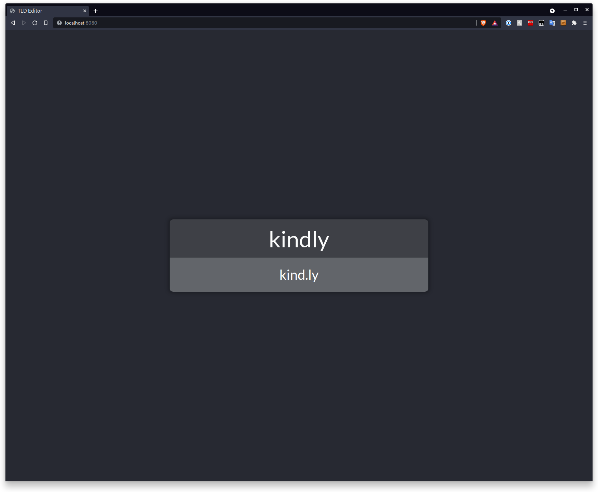

# What is this?

This is a simple React web app that does one thing, find matching TLD's to complete a word.

I.E. kindly -> kind.ly

That's all, nothing special :)

I made this after struggling to think of a project name and corresponding domain name for a university group project.

The application *may* be running at https://transname.loc0ded.com/

